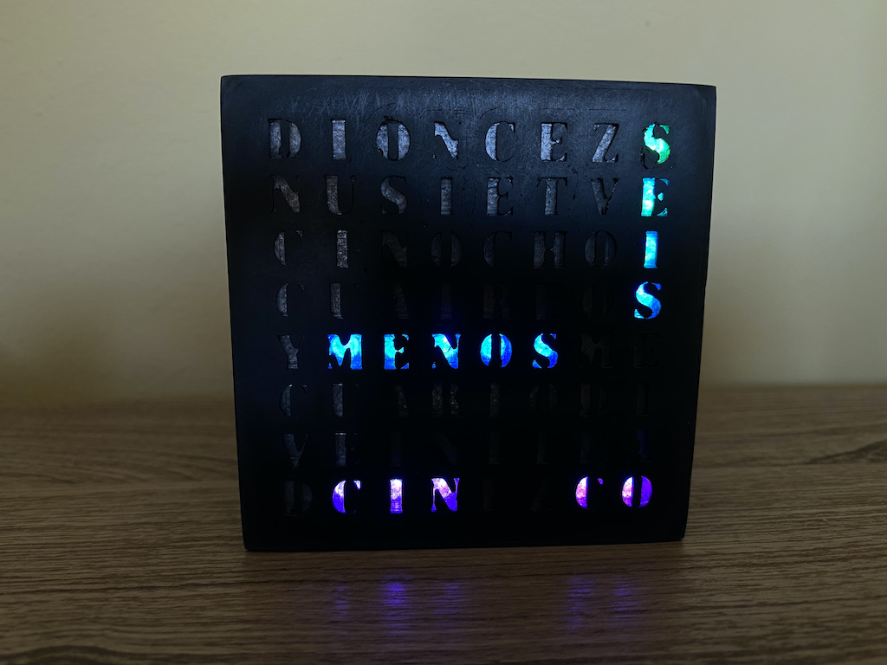

# WordClock

https://www.thingiverse.com/thing:4746782

## Features include:
* Accurate Clock refresh off Internet Time Servers
* Configured through Web Interface
* Display WordClock status on web server
* Basic Authorization around Configuration web interface
* Support for OTA (loading firmware over WiFi)
* Update firmware through web interface
* Configurable leds off/off times
* Configurable rainbow animation on the hour
* Based on:
  * Marquee Scroller by Qrome - https://github.com/Qrome/marquee-scroller 
  * 3D Printable NeoMatrix 8x8 Word by PawArmy - https://www.thingiverse.com/thing:931777

## Required Parts:
* Node MCU ESP8266
* CJMCU 64 Bit WS2812 5050 RGB NeoPixel MAtrix 8x8: https://www.banggood.com/CJMCU-64-Bit-WS2812-5050-RGB-LED-Driver-Development-Board-p-981678.html
* AC-DC 5V

Note: Using the links provided here help to support these types of projects. Thank you for the support.  

## Wiring 
* Please check https://github.com/Aircoookie/WLED/wiki 
* BUZZER_PIN *  D5
* LED_PIN     D4

## 3D Printed Case
Modified to match my 8x8 LED matrix from a design by [PawArmy](https://www.thingiverse.com/thing:931777)

## Compiling and Loading to ESP8266
It is recommended to use Arduino IDE.  You will need to configure Arduino IDE to work with your board and USB port and installed the required USB drivers etc.  
* Plase check [Marquee Scroller by Qrome](https://github.com/Qrome/marquee-scroller) project

## Loading Supporting Library Files in Arduino
Use the Arduino guide for details on how to installing and manage libraries https://www.arduino.cc/en/Guide/Libraries  
**Packages** -- the following packages and libraries are used (download and install):  

"FS.h"
<ESP8266WiFi.h>
<ESP8266WebServer.h>
<ESP8266HTTPUpdateServer.h>
<WiFiManager.h> // --> https://github.com/tzapu/WiFiManager
<ArduinoOTA.h>
<NTPClient.h> // --> https://github.com/arduino-libraries/NTPClient
<Adafruit_NeoPixel.h> // --> https://github.com/adafruit/Adafruit_NeoPixel

## Web Interface
The WordClock uses the **WiFiManager** so when it can't find the last network it was connected to 
it will become a **AP Hotspot** -- connect to it **WORD-CLOCK-chipID.local** with your phone and you can then enter your WiFi connection information.
